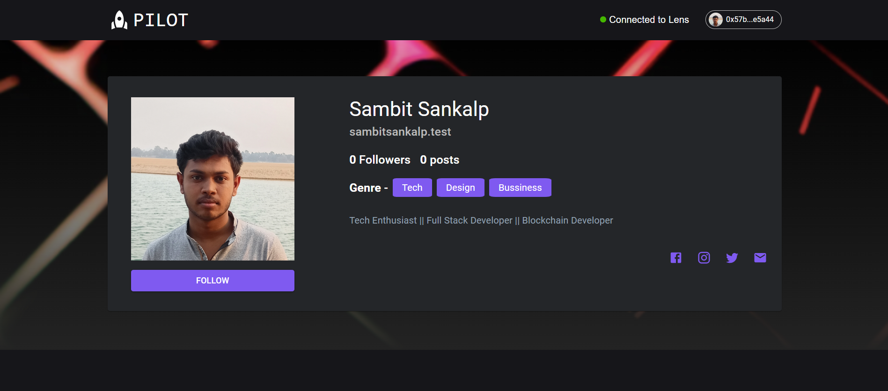
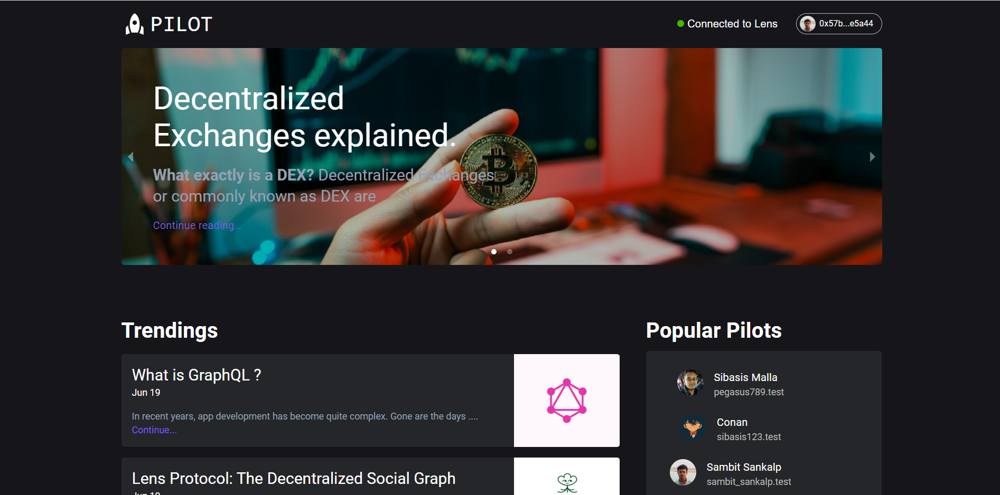
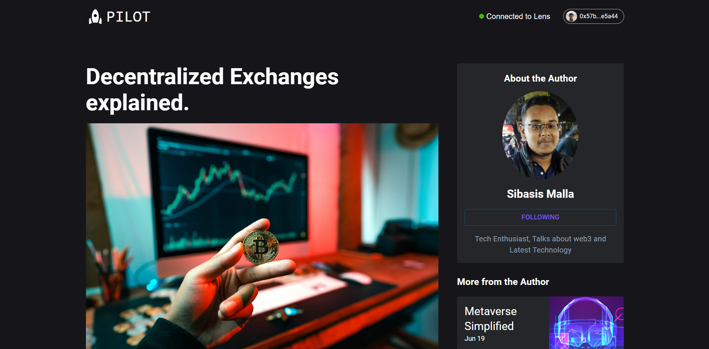

<br />
<p align="center">
  <a href="https://github.com/Sibasis-Malla/pilot">
    
  </a>

  <h3 align="center">Pilot</h3>

  <p align="center">
    The official repository for the website of PILOT
    <br />
    <a href="https://pilot-two.vercel.app/">View Live</a>
<!--     ·
    <a href="https://www.youtube.com/watch?v=LwG5t0DxFAc">Project Demo</a> -->
  </p>
</p>

<!-- TABLE OF CONTENTS -->
<details open="open">
  <summary>Table of Contents</summary>
  <ol>
    <li>
      <a href="#about-the-project">About The Project</a>
      <ul>
      </ul>
        <li><a href="#built-with">Built With</a></li>
    </li>
    <li>
      <a href="#getting-started">Getting Started</a>
      <ul>
        <li><a href="#prerequisites">Prerequisites</a></li>
        <li><a href="#running-the-project">Running the project</a></li>
      </ul>
    </li>
    <li><a href="#features">Features</a></li>
    <li><a href="#screenshots">Screenshots</a></li>
  </ol>
</details>

## About The Project

Pilot is decentralized Web3 Blogging platform built with Lens Protocol on Polygon.  

## Built With

Following technologies and libraries are used for the development of this website

- [React](https://reactjs.org/)
- [Lens Protocol](https://docs.lens.xyz/docs)
- [Apollo](https://www.apollographql.com/)
- [IPFS](https://ipfs.io/)
- [Material UI](https://mui.com/)
- [Draft-js](https://draftjs.org/)
- [Vercel](https://vercel.com/)

## Getting Started

To setup the project locally the steps below.

### Prerequisites

- Please make sure you have [metamask](https://metamask.io/) installed and connected to polygon's mumbai testnet and have some test matic in your wallet

- [Node.js](https://nodejs.org/en/download/)

  ```sh
  # Homebrew
  brew install nodejs

  # Sudo apt
  sudo apt install nodejs

  # Packman
  pacman -S nodejs

  # Module Install
  dnf module install nodejs:<stream> # stream is the version

  # Windows (chocolaty)
  cinst nodejs.install

  ```

- [Git](https://git-scm.com/downloads)

```sh
  # Homebrew
  brew install git

  # Sudo apt
  apt-get install git

  # Packman
  pacman -S git

  # Module Install (Fedora)
  dnf install git

```


### Running the project.

The project uses NPM. It is strictly advised to stick with NPM so as to avoid dependency conflicts down the line.

```
## Checkout into the project client directory
cd client

## Install Dependencies
npm install

## Run the Project
npm start

```

Following are the commands to remove/add new dependencies using yarn

```
## Add a new Package
npm install <package-name>

## Remove an existing Package
npm uninstall <package-name>

## Save Package as a Dev Dependency
npm install <package-name> --save-dev
```

## Features

* Text editor using Draft-js and React
* Blogging connections (like follow) using  decentralised social graph called Lens Protocol.
* Data ownership of creators on blockchain.

## Screenshots




